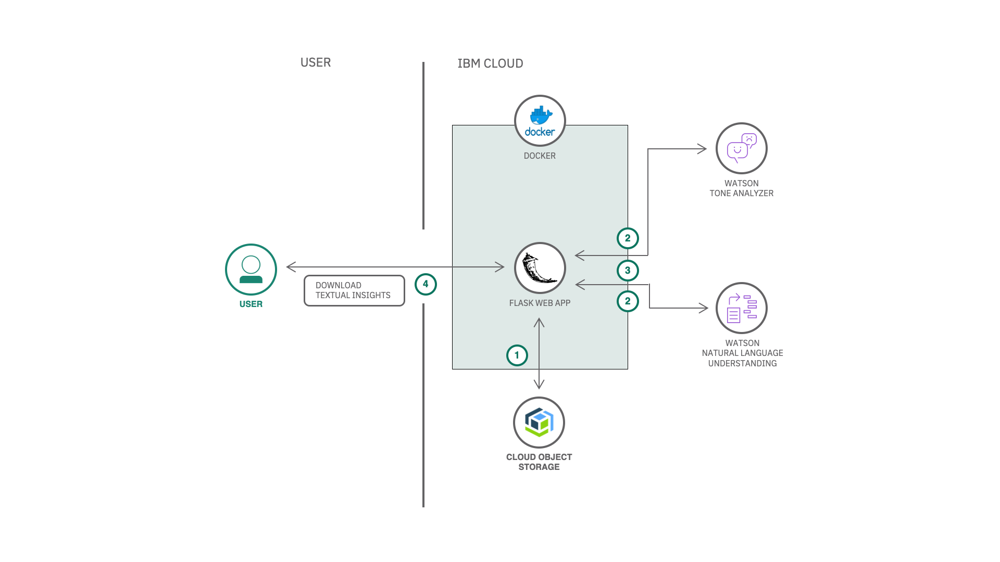
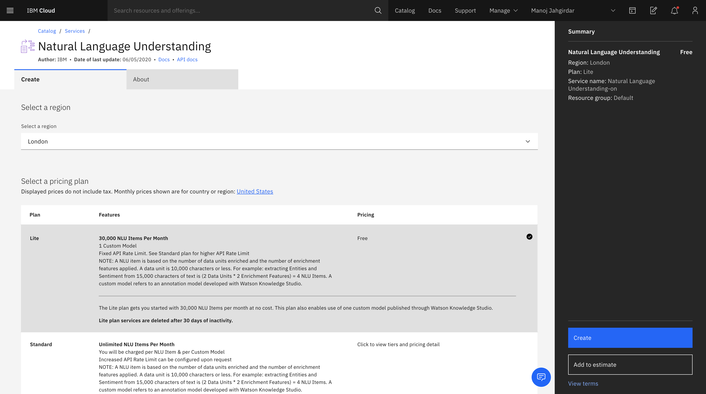
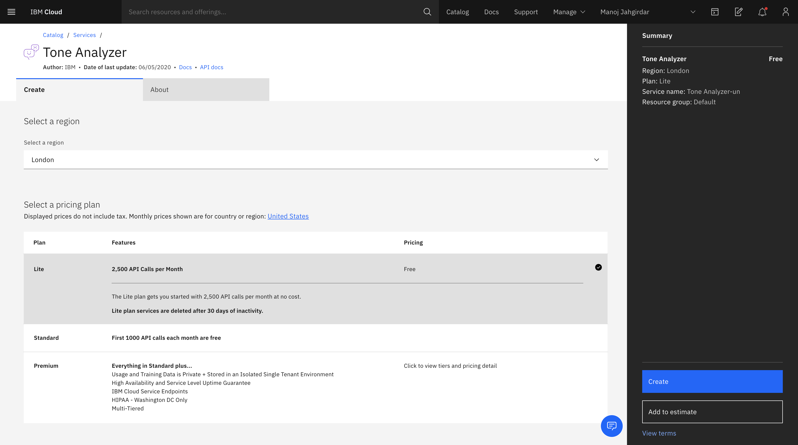
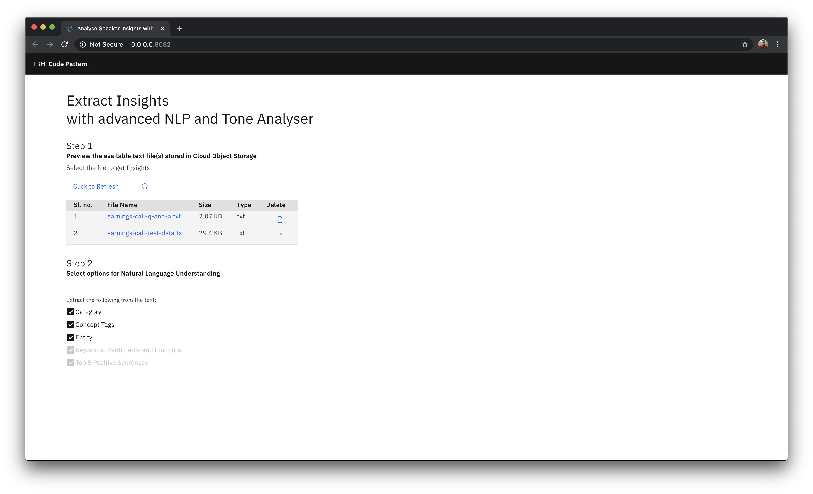

**Work in progress**

# Use Advanced NLP and Tone Analyser to extract insights

This Code Pattern is part of the series [Extracting Textual Insights from Videos with IBM Watson]()

Part of the World Health Organization's guidance on limiting further spread of COVID-19 is to practice social distancing. As a result, Companies in most affected areas are taking precautionary measures by encouraging Work from Home and Educational Institutes are closing their facilities. Employees working from home must be aware of the happenings in their company and need to collaborate with their team, students at home must be up to date with their education.

With the help of Technology, employees can continue to collaborate and be involved into their work with Virtual Meetings, Schools and teachers can continue to engage with their students through Virtual Classrooms.

In this code pattern, we will consume the transcribed text from [previous code pattern of the series](https://github.com/IBM/build-custom-stt-model-with-diarization) to extract key points and summary.

Given a video recording of the virtual meeting or a virtual classroom, textual insights are extracted from them to better understand the key pointer and summary of the meeting or lecture.

When you have completed this code pattern, you will understand how to:

* Use advanced NLP to analyze text and extract meta-data from content such as concepts, entities, keywords, categories, sentiment and emotion.
* Leverage Tone Analyzer's cognitive linguistic analysis to identify a variety of tones at both the sentence and document level.
* Connect applications directly to Cloud Object Storage.


<!--add an image in this path-->


<!--Optionally, add flow steps based on the architecture diagram-->
## Flow

1. The transcribed text from the [previous code pattern of the series](https://github.com/IBM/build-custom-stt-model-with-diarization) is retrived from Cloud Object Storage

2. Watson Natural Language Understanding and Watson Tone Analyzer is used to extract insights from the text.

3. The response from Natural Language Understanding and Watson Tone Analyzer is analyzed by the application and a Report is generated.

4. User can download the Report which consists of the textual insights.

<!--Optionally, update this section when the video is created-->
# Watch the Video

Coming Soon
<!-- [](https://www.youtube.com/watch?v=xgkYRJdBQ8E) -->

# Pre-requisites

1. [IBM Cloud](https://cloud.ibm.com) Account

2. [Docker](https://www.docker.com/products/docker-desktop)

3. [Python](https://www.python.org/downloads/release/python-365/)


# Steps

1. [Clone the repo](#1-clone-the-repo)

2. [Create Watson Services](#2-create-watson-services)

3. [Add the Credentials to the Application](#3-add-the-credentials-to-the-application)

4. [Deploy the Application](#4-deploy-the-application)

5. [Run the Application](#5-run-the-application)


### 1. Clone the repo

Clone the [`use-advanced-nlp-and-tone-analyser-to-analyse-speaker-insights`](https://github.com/IBM/use-advanced-nlp-and-tone-analyser-to-analyse-speaker-insights) repo locally. In a terminal, run:

```bash
$ git clone https://github.com/IBM/use-advanced-nlp-and-tone-analyser-to-analyse-speaker-insights
```

### 2. Create Watson Service

#### 2.1 Create Natural Language Understanding Service

- Create a [Natural Language Understanding Service](https://cloud.ibm.com/catalog/services/natural-language-understanding) on IBM Cloud.



- In Natural Language Understanding Resource Page, Click on **Services Credentials**

- Click on **New credential** and add a service credential as shown. Once the credential is created, copy and save the credentials in a text file for using it in later steps in this code pattern.


#### 2.2 Create Tone Analyzer Service

- Create a [Tone Analyzer Service](https://cloud.ibm.com/catalog/services/tone-analyzer) on IBM Cloud.



- In Tone Analyzer Resource Page, Click on **Services Credentials**

- Click on **New credential** and add a service credential as shown. Once the credential is created, copy and save the credentials in a text file for using it in later steps in this code pattern.


### 3. Add the Credentials to the Application

- In the repo parent folder, copy and pate the **credentials.json** file created in [first code pattern of the series](https://github.com/IBM/convert-video-to-audio). This will connect the application to the same Cloud Object Storage Bucket which was created in the first code pattern of the series.

- In the repo parent folder, open the **credentials1.json** file and paste the credentials copied in [step 2.1](#2.1-create-natural-language-understanding-service) and finally save the file.

- In the repo parent folder, open the **credentials2.json** file and paste the credentials copied in [step 2.2](#2.2-create-tone-analyzer-service) and finally save the file.


### 4. Deploy the Application

<details><summary><b>With Docker Installed</b></summary>

- Build the **Dockerfile** as follows :

```bash
$ docker image build -t use-advanced-nlp-to-extract-insights .
```

- once the dockerfile is built run the dockerfile as follows :

```bash
$ docker run -p 8080:8080 use-advanced-nlp-to-extract-insights
```

- The Application will be available on <http://localhost:8080>

</details>

<details><summary><b>Without Docker </b></summary>

- Install the python libraries as follows:

    - change directory to repo parent folder
    
    ```bash
    $ cd use-advanced-nlp-and-tone-analyser-to-analyse-speaker-insights/
    ```

    - use `python pip` to install the libraries

    ```bash
    $ pip install -r requirements.txt
    ```

- Finally run the application as follows:

```bash
$ python app.py
```

- The Application will be available on <http://localhost:8080>

</details>

### 5. Run the Application

- Visit  <http://localhost:8080> on your browser to run the application.



#### We Extract _Category_, _Concept Tags_, _Entity_, _Keywords_, _Sentiments_, _Emotions_, _Top 5 Positive Sentences_ and _Word Cloud_ from the text in just 2 steps:

1. Click on `earnings-call-test-data.txt` as the text file to extract insights.

2. Select the entities that you want to extract from the text and click on **Analyze**.


- Once the NLU Analysis Report is generated you can review it and print it as shown.


### More About the dataset

For the code pattern demonstration, we have considered `IBM Earnings Call Q1 2019` Webex recording. The data has 40min of IBM Revenue discussion, and 20+ min of Q & A at the end of the recording. We have split the data into 3 parts:

- `earnings-call-train-data.mp4` - (Duration - 24:40)
This is the initial part of the discussion from the recording which we will be using to train the custom Watson Speech To Text model in the second code pattern from the series.

- `earnings-call-test-data.mp4` - (Duration - 36:08)
This is the full discussion from the recording which will be used to test the custom Speech To Text model and also to get transcript for further analysis in the third code patten from the series.

- `earnings-call-Q-and-A.mp4` - (Duration - 2:40)
This is a part of Q & A's asked at the end of the meeting. The purpose of this data is to demonstrate how Watson Speech To Text can detect different speakers from an audio which will be demonstrated in the second code pattern from the series.

In the [next code pattern of the series](https://github.com/IBM/use-advanced-nlp-and-tone-analyser-to-analyse-speaker-insights) we will learn how link all the three code patterns of the series and build a consoladiated application where we can upload Video to get Diarized Text as well as NLU Analysis Report in a single application.

Thus Providing a set of open source tools, backed by IBM Cloud and Watson Services, will enable a better remote employee engagement pulse and will also enable educators to make content available for their students more easily.

<!-- keep this -->
## License

This code pattern is licensed under the Apache License, Version 2. Separate third-party code objects invoked within this code pattern are licensed by their respective providers pursuant to their own separate licenses. Contributions are subject to the [Developer Certificate of Origin, Version 1.1](https://developercertificate.org/) and the [Apache License, Version 2](https://www.apache.org/licenses/LICENSE-2.0.txt).

[Apache License FAQ](https://www.apache.org/foundation/license-faq.html#WhatDoesItMEAN)
